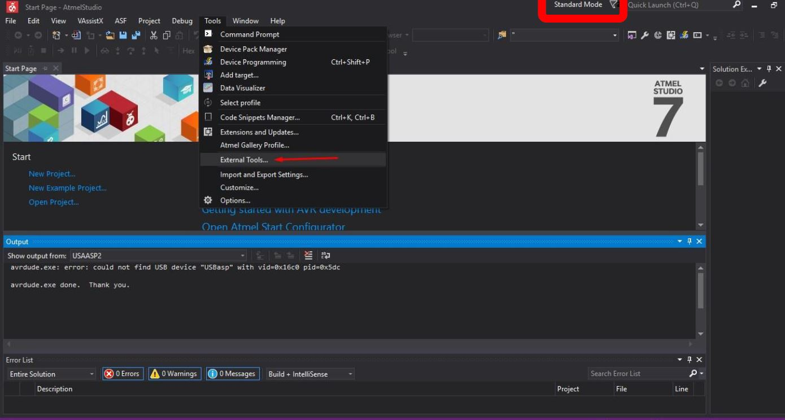
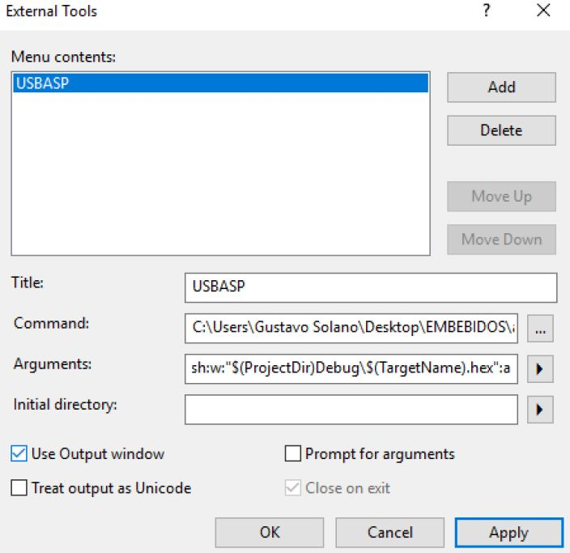
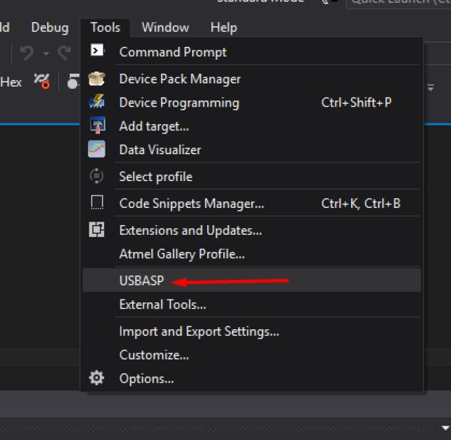
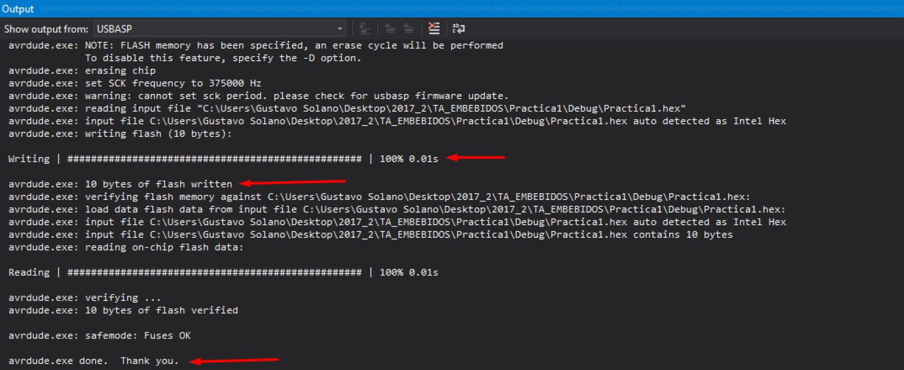

# Programar con Atmel Studio y USBASP

Guía básica de la configuración de la herramienta de Atmel Studio 7 para programar con el conector USBASP. Si quieres ver la conexión del conector USBASP, haz click [aquí](./README1.md).

## Requisito Previo

Contar con el  driver USBASP. Si no lo tienes, haz click [aquí](./README2.md).

## Instalación

- ### Paso 1

Descarga ***SinaProg 2.1*** haciendo click [aquí](https://github.com/electronica-utec/comunidad/raw/master/Embebidos/resources/SinaProg%202.1.rar).

- ### Paso 2

Abrir Atmel Studio. 


- ### Paso 3

Entrar a ***Tools*** y luego a ***External Tools***. Si esta opción no aparece, seleccionar la opción *Standard Mode* y cambiarla a *Advanced Mode*.



* ### Paso 4

Completar el cuadro con los siguientes parámetros:

```
Title:
USBASP

Command:
<Ruta del archivo avrdude.exe dentro de SinaProg 2.1>

Arguments:
avrdude -c usbasp -p m328p -U flash:w:"$(ProjectDir)Debug\$(TargetName).hex":a -F
```
Marcar la opción *Use Output window*.



Aceptar y cerrar.  Deberá aparecer USBASP en la pestaña *Tools* como se muestra en la siguiente figura.



## Prueba

Para subir el código de un proyecto al microcontrolador, en este caso un ATmega328P, solo es necesario presionar la opción *USBASP* previamente configurada. Los resultados en la ventana Output deberán ser similares a la siguiente imagen. Si quieres ver la conexión del conector USBASP, haz click [aquí](./README1.md).




## Autores

* [**Jhonatan Macazana**](https://github.com/jhonatanmacazana) - *Atmel Studio + USBASP*


## Reconocimientos

* Gustavo Solano y Franco Lama por el contenido y la estructura de la documentación.