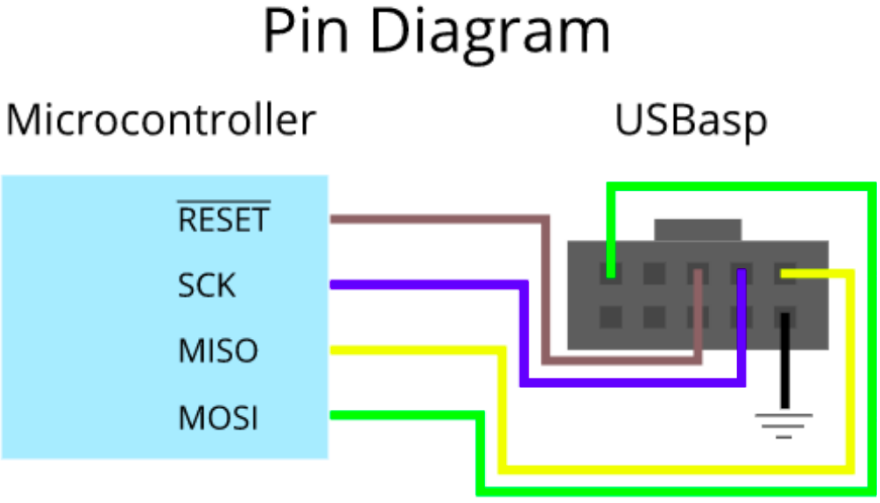

# USBASP - avrdude

Guía básica de la configuración del software ***avrdude*** y el conector ***USBASP***. 

## Requisito Previo

Contar con el  driver USBASP. Si no lo tienes, haz click [aquí](./README2.md).

## Pinout

Conectar los pines del microcontrolador con los pines correspondientes del conector USBASP. No olvidar la conexión a tierra y alimentación.



Marcar la opción *Use Output window*.


## Comandos

### Ejemplos con el ATmega328P

- Programar el código principal:


```
avrdude -c usbasp -p m328p -U flash:w:"$(ProjectDir)Debug\$(TargetName).hex":a -F
```

- Oscilador Interno con preescalador de 8 (1 MHz)

```
avrdude -c usbasp -p m328p -U lfuse:w:0x62:m -F
```

- Oscilador Interno sin preescalador (8 MHz)

```
avrdude -c usbasp -p m328p -U lfuse:w:0xE2:m -F
```

- Oscilador Externo (8 / 16 / 20 Mhz)

```
avrdude -c usbasp -p m328p -U lfuse:w:0xf7:m -F
```


## Autores

* [**Jhonatan Macazana**](https://github.com/jhonatanmacazana) - *avrdude*


## Reconocimientos

* [Joseph Peña](https://github.com/JosephPenaQuino) por el contenido y la estructura de la documentación.