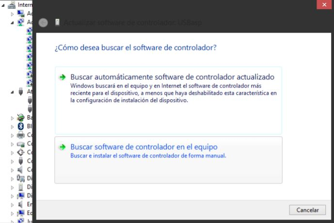

# Instalación del driver USBASP

Guía básica para la instalación del driver USBASP para Windows 10 o similares.

- ### Paso 1

Conectar el USBASP en el puerto USB. Ingresar a ***"Administrador de dispositivos"*** y dirigirse a ***Atmel USB Devices***. Verificar que el dispositivo USBasp no se encuentre con el signo de admiración amarillo. Si este es el caso, el driver se encuentra instalado; de lo contrario, realizar los siguientes pasos.

- ### Paso 2

Descargar el comprimido ***"Windows USBasp Drivers"*** haciendo click [aquí](https://github.com/electronica-utec/comunidad/raw/master/Embebidos/resources/Windows%20USBasp%20Drivers.zip). Descomprimir en la carpeta de su elección.

- ### Paso 3

Presionar la tecla ***Shift*** y reiniciar su computadora sin dejar de presionar la tecla. Al reiniciar el sistema aparecerá la siguiente ventana de opciones. Seleccionar ***Solucionar Problemas***.

Elegir la opción ***Restablecer tu PC***.

Ingresar a ***Configuración de inicio***.

Presionar el botón de ***Reiniciar***.

Elegir la opción ***7) Deshabilitar el uso obligatorio de controladores firmados*** presionando la tecla 7.

El equipo se reiniciará. 

- ### Paso 4

Hacer clik derecho en USBasp e ingresar a ***Actualizar software de controlador ...***.

Elegir la opción ***Buscar software de controlador en el equipo***.

Finalmente, elegir la carpeta libusb_1.2.4.0 descargado en el paso 2. Aceptar e ignorar si aparece un mensaje de advertencia.

Si todo está instalado correctamente, aparecerá el siguiente mensaje.

## Autores

* [**Jhonatan Macazana**](https://github.com/jhonatanmacazana) - *Driver USBASP*

## Reconocimientos

* Gustavo Solano y Franco Lama por el contenido y la estructura de la documentación.